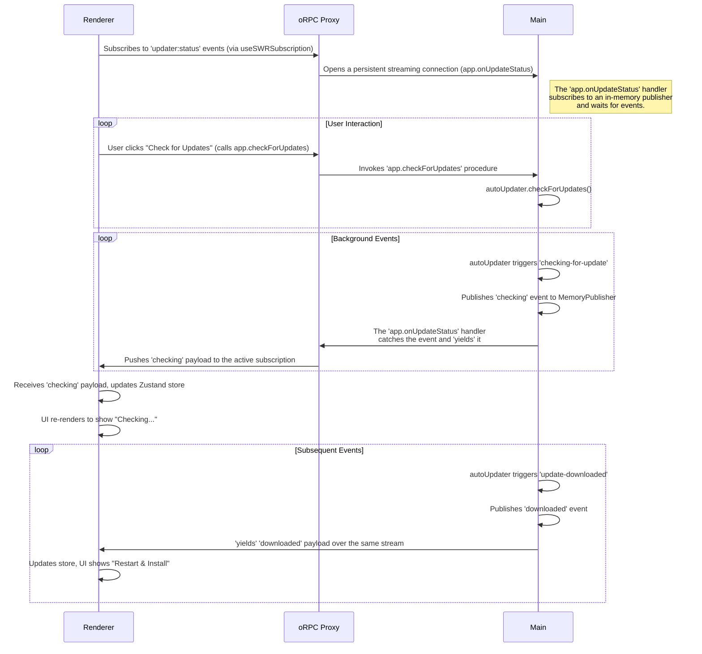

## Architecture

The new architecture unifies all real-time and request-response communication within the oRPC framework, eliminating the need for a separate event-forwarding mechanism. It uses a publisher-subscriber pattern on the server and an oRPC stream on the client.

### 1. Process Interaction Diagram

### 2. Key Components

*   **`MemoryPublisher` (@orpc/experimental-publisher)**: A singleton instance in the main process will act as a central, in-memory event bus. Any part of the main process (like the `autoUpdater` service) can publish events to it without being coupled to the IPC layer.
*   **Streaming oRPC Endpoint (`async function*`)**: A dedicated oRPC handler (e.g., `app.onUpdateStatus`) will be an async generator. It will subscribe to the `MemoryPublisher` and use a `for await...of` loop to listen for events, `yield`-ing each one to the client as it arrives. This creates a long-lived, type-safe stream.
*   **`useSWRSubscription`**: The client will use this hook (or a custom wrapper around it) to connect to the streaming endpoint. It will manage the lifecycle of the subscription, providing new data to the React component as it's pushed from the server.

### 3. Feasibility and Risk Analysis

This architecture is highly feasible and leverages the advanced capabilities of oRPC, leading to a cleaner, more maintainable, and fully type-safe implementation.

#### Risks and Mitigation

1.  **Risk: macOS Code Signing (Out of Scope)**
    -   **Description**: For a real-world production application, Electron's `autoUpdater` requires the macOS build to be code-signed to function correctly.
    -   **Decision**: Per our discussion, since this is a template project, implementing code-signing is considered out of scope. The feature will be built, but end-to-end testing on macOS will depend on the final user's build and signing configuration.

2.  **Risk: Properly Formatted GitHub Release**
    -   **Description**: The updater relies on a GitHub Release that contains the correct artifacts and metadata files (e.g., `latest-mac.yml`). If a release is drafted without these files, the update check will fail.
    -   **Mitigation**: The release process should be automated (e.g., via GitHub Actions) to ensure releases are always generated correctly. The implementation will also include error handling to manage failed checks gracefully.
